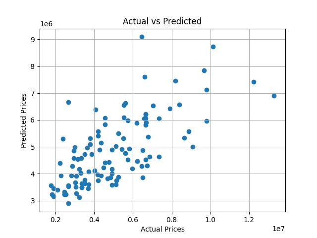

# 🏠 House Price Prediction - Linear Regression

## Task 3 – AI & ML Internship (Elevate Labs)

### 📌 Objective
To build a simple and multiple linear regression model using real housing data to predict house prices.

---

### 🧰 Tools Used
- Python
- Pandas
- Scikit-learn
- Matplotlib
- Seaborn

---

### 📊 Steps Performed
1. Loaded and explored the housing dataset
2. Encoded categorical variables (like 'yes'/'no' to 1/0)
3. Selected key features: `area`, `bedrooms`, `bathrooms`
4. Split data into training and testing sets (80-20 split)
5. Trained a Linear Regression model
6. Made predictions on test data
7. Evaluated model using:
   - MAE (Mean Absolute Error)
   - MSE (Mean Squared Error)
   - R² Score
8. Visualized actual vs. predicted prices

---

### 🔍 Key Observations
- The model uses `area`, `bedrooms`, and `bathrooms` to predict prices.
- Linear regression performed reasonably well.
- Room and bathroom count significantly affect house prices.
- Adding more features (like `stories`, `furnishingstatus`, `airconditioning`) could improve accuracy.

---

### 📈 Model Performance
| Metric       | Value                |
|--------------|----------------------|
| MAE          | ₹12,65,275           |
| MSE          | ₹2.75 Trillion       |
| R² Score     | **0.456**            |

---

### 📐 Model Equation (Simplified):

---

### ⚙️ Coefficients (from model)
- **Intercept**: ₹59,485  
- **Area**: ₹345 per sq. ft  
- **Bedrooms**: ₹3.6 Lakhs  
- **Bathrooms**: ₹14.2 Lakhs

---

### 📸 Visualization

---

###  Dataset Source
[House Price Prediction Dataset – Kaggle](https://www.kaggle.com/datasets/harishkumardatalab/housing-price-prediction)

---

### ✅ Outcome
Successfully completed as part of Task 3 in the **Elevate Labs AI & ML Internship**.

---
